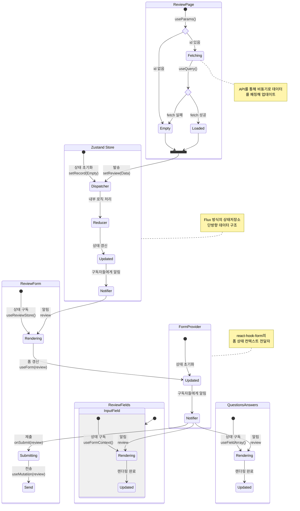

# 면접 회고 마이크로 프론트엔드

> Single-Spa Application 구성

## 🚩 목차

-   [🛠️ 기술 스택](#️-기술-스택)
-   [💁 소개](#-소개)
-   [🎥 데모](#-데모)
-   [💡 주요 기능](#-주요-기능)
-   [🧩 컴포넌트 구성](#-컴포넌트-구성)
-   [🚀 실행 방법](#-실행-방법)
-   [📂 폴더 구조](#-폴더-구조)

## 🛠️ 기술 스택

[](https://ko.vite.dev)
[](https://www.typescriptlang.org/)  
[](https://tanstack.com/query/v5/docs/framework/react/overview)
[](https://reactrouter.com/)
[](https://react-hook-form.com/)  
[](https://www.chakra-ui.com/)
[](https://zod.dev/)  
[](https://single-spa.js.org/)
[![Steiger](https://img.shields.io/badge/FSD_Steiger-211b1d.svg?logo=data:image/svg+xml;base64,PD94bWwgdmVyc2lvbj0iMS4wIiBlbmNvZGluZz0iVVRGLTgiPz4KPHN2ZyB2ZXJzaW9uPSIxLjEiIHhtbG5zPSJodHRwOi8vd3d3LnczLm9yZy8yMDAwL3N2ZyIgd2lkdGg9IjIwMCIgaGVpZ2h0PSIyMDAiPgo8cGF0aCBkPSJNMCAwIEMyOC4zOCAwIDU2Ljc2IDAgODYgMCBDODYgMy42MyA4NiA3LjI2IDg2IDExIEM1Ny42MiAxMSAyOS4yNCAxMSAwIDExIEMwIDcuMzcgMCAzLjc0IDAgMCBaICIgZmlsbD0iI0VCRUFFQSIgdHJhbnNmb3JtPSJ0cmFuc2xhdGUoNTcsMTAyKSIvPgo8cGF0aCBkPSJNMCAwIEMyOC4zOCAwIDU2Ljc2IDAgODYgMCBDODYgMy42MyA4NiA3LjI2IDg2IDExIEM1Ny42MiAxMSAyOS4yNCAxMSAwIDExIEMwIDcuMzcgMCAzLjc0IDAgMCBaICIgZmlsbD0iI0VCRUFFQSIgdHJhbnNmb3JtPSJ0cmFuc2xhdGUoNTcsODcpIi8+CjxwYXRoIGQ9Ik0wIDAgQzI4LjM4IDAgNTYuNzYgMCA4NiAwIEM4NiAzLjYzIDg2IDcuMjYgODYgMTEgQzU3LjYyIDExIDI5LjI0IDExIDAgMTEgQzAgNy4zNyAwIDMuNzQgMCAwIFogIiBmaWxsPSIjRUJFQUVBIiB0cmFuc2Zvcm09InRyYW5zbGF0ZSg1Nyw1NykiLz4KPHBhdGggZD0iTTAgMCBDMjguMzggMCA1Ni43NiAwIDg2IDAgQzg2IDMuNjMgODYgNy4yNiA4NiAxMSBDNTcuNjIgMTEgMjkuMjQgMTEgMCAxMSBDMCA3LjM3IDAgMy43NCAwIDAgWiAiIGZpbGw9IiNFQkVBRUEiIHRyYW5zZm9ybT0idHJhbnNsYXRlKDU3LDQyKSIvPgo8cGF0aCBkPSJNMCAwIEMxMy41MyAwIDI3LjA2IDAgNDEgMCBDNDEgMy42MyA0MSA3LjI2IDQxIDExIEMyNy40NyAxMSAxMy45NCAxMSAwIDExIEMwIDcuMzcgMCAzLjc0IDAgMCBaICIgZmlsbD0iI0U5RThFOCIgdHJhbnNmb3JtPSJ0cmFuc2xhdGUoNTcsMTQ3KSIvPgo8cGF0aCBkPSJNMCAwIEMxMy41MyAwIDI3LjA2IDAgNDEgMCBDNDEgMy42MyA0MSA3LjI2IDQxIDExIEMyNy40NyAxMSAxMy45NCAxMSAwIDExIEMwIDcuMzcgMCAzLjc0IDAgMCBaICIgZmlsbD0iI0U5RThFOCIgdHJhbnNmb3JtPSJ0cmFuc2xhdGUoNTcsMTMyKSIvPgo8cGF0aCBkPSJNMCAwIEMxMy41MyAwIDI3LjA2IDAgNDEgMCBDNDEgMy42MyA0MSA3LjI2IDQxIDExIEMyNy40NyAxMSAxMy45NCAxMSAwIDExIEMwIDcuMzcgMCAzLjc0IDAgMCBaICIgZmlsbD0iI0U5RThFOCIgdHJhbnNmb3JtPSJ0cmFuc2xhdGUoNTcsMTE3KSIvPgo8cGF0aCBkPSJNMCAwIEMxMy41MyAwIDI3LjA2IDAgNDEgMCBDNDEgMy42MyA0MSA3LjI2IDQxIDExIEMyNy40NyAxMSAxMy45NCAxMSAwIDExIEMwIDcuMzcgMCAzLjc0IDAgMCBaICIgZmlsbD0iI0U5RThFOCIgdHJhbnNmb3JtPSJ0cmFuc2xhdGUoNTcsNzIpIi8+Cjwvc3ZnPgo=&style=flat-square&logoColor=black)](https://github.com/feature-sliced/steiger)
[](https://eslint.org/)

## 💁 소개

본 서비스는 사용자가 면접 경험을 체계적으로 기록하고, 손쉽게 관리할 수 있도록 다양한 기능을 제공합니다. 면접 준비부터 회고까지의 전 과정을 하나의 플랫폼 내에서 관리할 수 있도록 설계되어, 사용자 스스로 면접 경험을 분석하고 다음 면접을 보다 효과적으로 준비할 수 있도록 지원합니다.

## 🎥 데모

https://github.com/user-attachments/assets/041f1ff0-b27c-4bb3-888b-2bfcc7db620b

## 💡 주요 기능

| 주요 기능            | 내용                                                                                                                                                                           |
| -------------------- | ------------------------------------------------------------------------------------------------------------------------------------------------------------------------------ |
| 면접 회고 추가       | 면접 정보, 사전 준비, 진행 과정, 질문과 답변, 의사소통, 면접 분석, 다음 면접 준비 등으로 구성된 템플릿을 제공하여 사용자가 면접 경험을 체계적으로 기록할 수 있도록 지원합니다. |
| 면접 회고 조회       | 사용자가 작성한 면접 회고를 조회할 수 있는 기능을 제공합니다.                                                                                                                  |
| 면접 회고 수정       | 사용자가 기존에 작성한 면접 회고의 내용을 수정할 수 있도록 합니다.                                                                                                             |
| 면접 회고 삭제       | 사용자가 작성한 면접 회고를 삭제할 수 있는 기능을 제공합니다.                                                                                                                  |
| 회고 리스트 사이드바 | 사용자가 작성한 회고 목록을 화면 좌측 사이드바에 회사명과 면접 유형 형식으로 표출하여, 손쉽게 목록을 확인하고 접근할 수 있도록 합니다.                                         |
| 섹션 바              | 화면 우측에 위치한 섹션 바를 통해 면접 정보, 사전 준비, 진행 과정, 질문과 답변, 의사소통, 면접 분석, 다음 면접 준비 섹션으로 신속하게 이동할 수 있도록 지원합니다.             |

## 🧩 컴포넌트 구성


### 📊 상태 전이 다이어그램



## 🚀 실행 방법

```sh
$ npm install
$ npm run dev
```

## 📂 폴더 구조

```
PickMe-Review-Application
├─ .env
├─ .env.sample
├─ .env.single-spa
├─ .prettierrc
├─ index.html
├─ package-lock.json
├─ package.json
├─ setup.ps1
├─ setup.zsh
├─ src
│  ├─ app
│  │  ├─ App.tsx
│  │  ├─ application.tsx
│  │  ├─ main.tsx
│  │  ├─ parcel.tsx
│  │  └─ router.tsx
│  ├─ entities
│  │  └─ review
│  │     └─ model
│  │        └─ review.ts
│  ├─ features
│  │  ├─ review
│  │  │  ├─ api
│  │  │  │  ├─ deleteReviewApi.ts
│  │  │  │  ├─ getReviewApi.ts
│  │  │  │  ├─ index.ts
│  │  │  │  ├─ initialFormData.ts
│  │  │  │  ├─ postReviewApi.ts
│  │  │  │  ├─ putReviewApi.ts
│  │  │  │  └─ reviewDTOList.ts
│  │  │  ├─ hook
│  │  │  │  └─ useReviewMutation.ts
│  │  │  ├─ index.tsx
│  │  │  ├─ schema
│  │  │  │  └─ reviewSchema.ts
│  │  │  ├─ service
│  │  │  │  ├─ dtoToReview.ts
│  │  │  │  └─ reviewToDto.ts
│  │  │  ├─ store
│  │  │  │  └─ useReviewStore.ts
│  │  │  ├─ ui
│  │  │  │  ├─ ActionButton.tsx
│  │  │  │  ├─ DynamicReviewFields.tsx
│  │  │  │  ├─ index.ts
│  │  │  │  ├─ InputField.tsx
│  │  │  │  ├─ InterviewReviewParts.tsx
│  │  │  │  ├─ QuestionsAnswers.tsx
│  │  │  │  ├─ ReviewForm.tsx
│  │  │  │  └─ TextAreaField.tsx
│  │  │  └─ util
│  │  │     ├─ getFieldKeyMap.ts
│  │  │     └─ safeReadDictionary.ts
│  │  └─ side
│  │     ├─ api
│  │     │  ├─ getSideDTO.ts
│  │     │  └─ sideApi.tsx
│  │     ├─ index.tsx
│  │     ├─ store
│  │     │  └─ useSideStore.ts
│  │     └─ ui
│  │        ├─ SearchBar.tsx
│  │        ├─ sectionNav
│  │        │  └─ SectionBar.tsx
│  │        └─ side.tsx
│  ├─ pages
│  │  └─ review
│  │     ├─ index.tsx
│  │     └─ ui
│  │        └─ firstRender.tsx
│  └─ shared
│     ├─ api
│     │  └─ router.ts
│     ├─ chakra-ui
│     │  ├─ close-button.tsx
│     │  ├─ color-mode.tsx
│     │  ├─ drawer.tsx
│     │  ├─ field.tsx
│     │  └─ provider.tsx
│     ├─ data
│     │  └─ ReviewDict.ts
│     └─ store
│        └─ useReviewIdStore.ts
├─ steiger.config.ts
├─ styleguide-types.d.ts
├─ tsconfig.app.json
├─ tsconfig.json
├─ tsconfig.node.json
├─ vite-env.d.ts
└─ vite.config.ts

```
